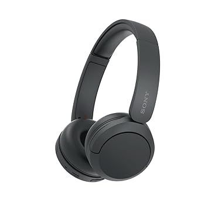

# Muffled 860-ANC Headphones - Web Project



## 📜 Project Overview

An engaging and interactive React web application showcasing the Muffled 860-ANC headphones. The website features a modern, responsive UI with smooth animations, 3D effects, and a seamless user experience.

## ✨ Features

- **Interactive UI**: Animated elements using Framer Motion and custom cursor effects
- **Product Showcase**: Multiple product variants with detailed specifications
- **Responsive Design**: Works seamlessly on desktop and mobile devices
- **Modern Aesthetics**: Clean, professional design with Tailwind CSS
- **Customer Testimonials**: Displays user reviews and ratings
- **Contact Form**: Easy communication with the sales team
- **Checkout System**: Simple and intuitive purchasing process

## 🛠️ Technologies Used

### Core Technologies
- React.js (v18.3.1)
- React Router (v7.4.1)
- Tailwind CSS (v3.4.6)
- Framer Motion (v11.3.8)

### Additional Libraries
- React Icons (v5.2.1)
- React Mouse Follower (v2.0.3)

## 🚀 Getting Started

### Prerequisites
- Node.js (v16 or later)
- npm or yarn

### Installation

1. Clone the repository:
   ```bash
   git clone <repository-url>
   cd Web-Project
   ```

2. Install dependencies:
   ```bash
   npm install
   # or 
   yarn install
   ```

3. Start the development server:
   ```bash
   npm start
   # or 
   yarn start
   ```

4. Open your browser and visit `http://localhost:3000`

## 📂 Project Structure

```
Web-Project/
├── public/               # Public assets
├── src/                  # Source code
│   ├── components/       # React components
│   │   ├── Banner/       # Banner components
│   │   ├── Checkout/     # Checkout components
│   │   ├── Footer/       # Footer components
│   │   ├── Hero/         # Hero section components
│   │   ├── Reviews/      # Reviews components
│   │   ├── Services/     # Services components
│   │   ├── About.js      # About page
│   │   ├── Contact.js    # Contact page
│   │   └── Navbar.jsx    # Navigation component
│   ├── Images/           # Image assets
│   ├── App.js            # Main application component
│   ├── App.css           # Application styles
│   ├── index.js          # Entry point
│   └── index.css         # Global styles
├── package.json          # Project dependencies and scripts
├── tailwind.config.js    # Tailwind CSS configuration
└── README.md             # Project documentation
```

## 📱 Pages

### Home Page
The landing page features a hero section showcasing the Muffled 860-ANC headphones with different color variants. Users can view product details and navigate to the checkout page.

### About Page
Provides information about the company and product philosophy.

### Contact Page
A contact form for users to reach out to the sales team.

### Reviews Page
Displays customer testimonials and ratings for the Muffled 860-ANC headphones.

### Checkout Page
A streamlined checkout process for purchasing the headphones.

## 🎨 Styling

The project uses Tailwind CSS for styling with custom configurations:
- Custom color palette with primary and brand colors
- Custom fonts: Poppins and Gotham
- Responsive container settings

## 🔄 State Management

React's built-in state management is used throughout the application:
- Component-level state using React hooks
- Props for component communication

## 🎬 Animations

Animations are implemented using Framer Motion:
- Fade-in and slide-up animations for components
- Interactive hover effects
- Custom cursor effects with React Mouse Follower

## 📱 Responsive Design

The website is fully responsive with optimized layouts for:
- Mobile devices
- Tablets
- Desktop screens

## 📞 Contact

For inquiries, contact us via the Contact page in the application. 